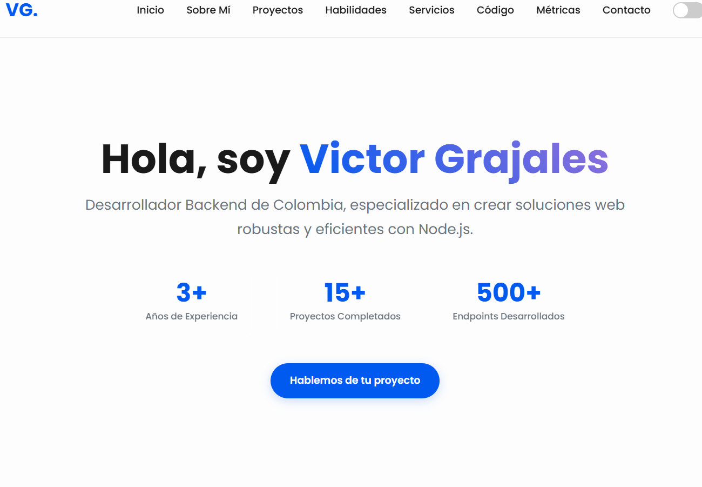
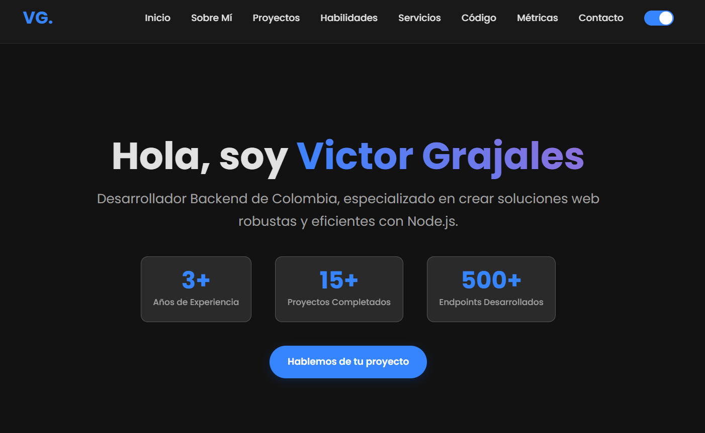
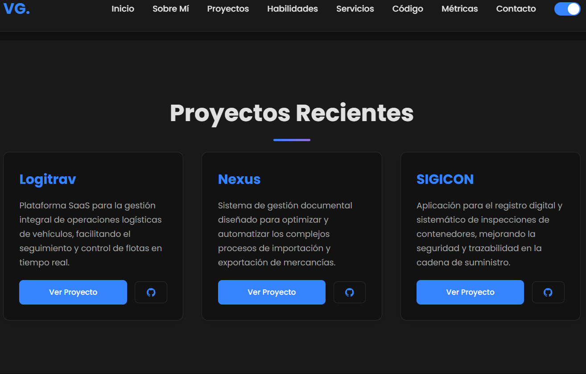
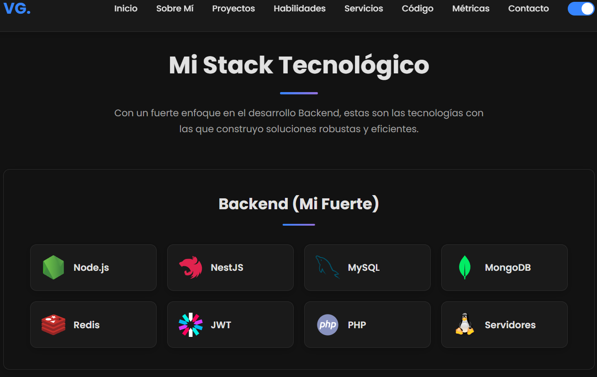
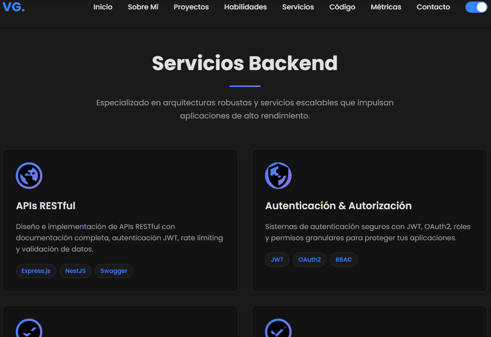
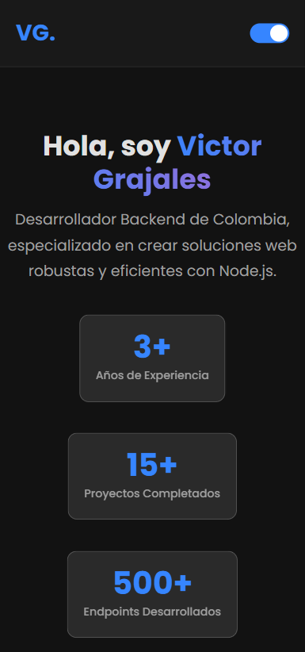

# Portfolio Profesional - Backend Developer

## 📸 Vista Previa

### 🖥️ Capturas de Pantalla del Portfolio


*Vista general del portfolio en modo claro*


*Portfolio en modo oscuro con todas las secciones*


*Sección Hero con estadísticas y presentación personal*


*Sección de habilidades organizadas por categorías*


*Servicios backend especializados*


*Vista responsive en dispositivos móviles*

---

## 📁 Estructura del Proyecto

```
📁 Portfolio/
├── 📄 index.html (HTML principal)
├── 📁 css/
│   └── 📄 main.css (Todos los estilos)
├── 📁 js/
│   └── 📄 main.js (JavaScript y funcionalidades)
├── 📁 data/
│   ├── 📄 projects.json (Datos de proyectos)
│   ├── 📄 stack.json (Datos de habilidades)
│   ├── 📄 servicios_backend.json (Datos de servicios backend)
│   └── 📄 experience.json (Datos de experiencia laboral)
├── 📁 image/
│   ├── 📄 nodejs.svg
│   ├── 📄 nestjs.svg
│   ├── 📄 mysql.svg
│   ├── 📄 redis.svg
│   ├── 📄 docker.svg
│   ├── 📄 jwt.svg
│   ├── 📄 php.svg
│   ├── 📄 servidores.svg
│   ├── 📄 react.svg
│   ├── 📄 nextjs.svg
│   ├── 📄 javascript.svg
│   ├── 📄 typescript.svg
│   ├── 📄 tailwind.svg
│   ├── 📄 github.svg
│   ├── 📄 npm.svg
│   ├── 📄 terminal.svg
│   ├── 📄 vscode.svg
│   ├── 📄 cursor.svg
│   ├── 📄 docker-herramientas.svg
│   ├── 📄 api.svg
│   ├── 📄 auth.svg
│   ├── 📄 database.svg
│   ├── 📄 microservices.svg
│   ├── 📄 testing.svg
│   ├── 📄 monitoring.svg
│   └── 📁 screenshots/
│       └── 📄 (Capturas de pantalla del portfolio)
└── 📄 README.md (Esta documentación)
```

## 🚀 Cómo Agregar Nuevos Proyectos

### Método 1: Editar `data/projects.json`

Para agregar un nuevo proyecto, simplemente edita el archivo `data/projects.json` y añade un nuevo objeto al array `proyectos`:

```json
{
  "proyectos": [
    {
      "id": 4,
      "titulo": "Mi Nuevo Proyecto",
      "descripcion": "Descripción detallada del proyecto y sus funcionalidades principales.",
      "url_proyecto": "https://mi-proyecto.com",
      "url_github": "https://github.com/usuario/repositorio",
      "tecnologias": ["Node.js", "React", "MySQL"],
      "imagen": null,
      "destacado": true
    }
  ]
}
```

### 📋 Campos Disponibles

| Campo | Tipo | Descripción | Requerido |
|-------|------|-------------|-----------|
| `id` | number | Identificador único del proyecto | ✅ |
| `titulo` | string | Nombre del proyecto | ✅ |
| `descripcion` | string | Descripción detallada | ✅ |
| `url_proyecto` | string | URL del proyecto en vivo | ✅ |
| `url_github` | string | URL del repositorio GitHub | ✅ |
| `tecnologias` | array | Array de tecnologías utilizadas | ❌ |
| `imagen` | string/null | URL de imagen del proyecto | ❌ |
| `destacado` | boolean | Si el proyecto debe destacarse | ❌ |

### 🎯 Ejemplo Completo

```json
{
  "id": 5,
  "titulo": "E-Commerce API",
  "descripcion": "API RESTful completa para plataforma de comercio electrónico con autenticación JWT, gestión de productos, carrito de compras y sistema de pagos integrado.",
  "url_proyecto": "https://ecommerce-api.vercel.app",
  "url_github": "https://github.com/usuario/ecommerce-api",
  "tecnologias": ["NestJS", "TypeScript", "PostgreSQL", "Redis", "JWT"],
  "imagen": "https://ejemplo.com/imagen-proyecto.jpg",
  "destacado": true
}
```

## 🛠️ Modularización de Habilidades

### 📁 Archivo: `data/stack.json`

Las habilidades se cargan dinámicamente desde `data/stack.json`. Este archivo contiene todas las categorías y habilidades organizadas.

### 📋 Estructura del JSON

```json
{
  "categorias": [
    {
      "id": "backend",
      "titulo": "Backend (Mi Fuerte)",
      "habilidades": [
        {
          "id": "nodejs",
          "nombre": "Node.js",
          "icono": "https://www.vectorlogo.zone/logos/nodejs/nodejs-icon.svg",
          "tipo": "imagen"
        },
        {
          "id": "jwt",
          "nombre": "JWT",
          "icono": "<svg xmlns=\"http://www.w3.org/2000/svg\" viewBox=\"0 0 24 24\" fill=\"currentColor\"><path d=\"M12 2C6.48 2 2 6.48 2 12s4.48 10 10 10 10-4.48 10-10S17.52 2 12 2zm-2 15l-5-5 1.41-1.41L10 14.17l7.59-7.59L19 8l-9 9z\"/></svg>",
          "tipo": "svg"
        }
      ]
    }
  ]
}
```

### 📋 Campos Disponibles para Habilidades

| Campo | Tipo | Descripción | Requerido |
|-------|------|-------------|-----------|
| `id` | string | Identificador único de la categoría | ✅ |
| `titulo` | string | Título de la categoría | ✅ |
| `habilidades` | array | Array de habilidades en la categoría | ✅ |
| `habilidades[].id` | string | ID único de la habilidad | ✅ |
| `habilidades[].nombre` | string | Nombre de la habilidad | ✅ |
| `habilidades[].icono` | string | URL de imagen o SVG inline | ✅ |
| `habilidades[].tipo` | string | "imagen" o "svg" | ✅ |

### 🎯 Cómo Agregar Nuevas Habilidades

1. **Abrir el archivo**: `data/stack.json`
2. **Agregar nueva categoría** (si es necesaria):
   ```json
   {
     "id": "nueva-categoria",
     "titulo": "Nueva Categoría",
     "habilidades": []
   }
   ```
3. **Agregar nueva habilidad**:
   ```json
   {
     "id": "nueva-habilidad",
     "nombre": "Nueva Tecnología",
     "icono": "https://ejemplo.com/icono.svg",
     "tipo": "imagen"
   }
   ```
4. **Para iconos SVG personalizados**:
   ```json
   {
     "id": "mi-svg",
     "nombre": "Mi SVG",
     "icono": "<svg xmlns=\"http://www.w3.org/2000/svg\" viewBox=\"0 0 24 24\" fill=\"currentColor\"><path d=\"...\"/></svg>",
     "tipo": "svg"
   }
   ```

### 🚀 Beneficios de la Modularización de Habilidades

- **🔧 Mantenimiento Fácil**: Solo editar JSON para agregar habilidades
- **⚡ Carga Rápida**: Los datos se cargan dinámicamente
- **🛡️ Robusto**: Manejo de errores incluido
- **📱 Responsive**: Mantiene el diseño responsive
- **🎨 Consistente**: Mismo diseño y animaciones
- **🎯 Organizado**: Categorías claras y bien estructuradas

## 🖼️ Gestión de Iconos

### 📁 Carpeta: `image/`

Todos los iconos de las habilidades deben estar almacenados en la carpeta `image/` como archivos SVG locales. Esto mejora la confiabilidad y el rendimiento del portfolio.

### 📋 Iconos Requeridos

El sistema requiere los siguientes iconos en la carpeta `image/`:

#### 🔧 Backend
- `nodejs.svg` - Node.js
- `nestjs.svg` - NestJS
- `mysql.svg` - MySQL
- `redis.svg` - Redis
- `docker.svg` - Docker
- `jwt.svg` - JWT
- `php.svg` - PHP
- `servidores.svg` - Servidores

#### 🎨 Frontend
- `react.svg` - React
- `nextjs.svg` - Next.JS
- `javascript.svg` - JavaScript
- `typescript.svg` - TypeScript
- `tailwind.svg` - Tailwind CSS

#### 🛠️ Herramientas
- `github.svg` - GitHub
- `npm.svg` - npm
- `terminal.svg` - Terminal
- `vscode.svg` - VS Code
- `cursor.svg` - Cursor
- `docker-herramientas.svg` - Docker (Herramientas)

### 📥 Cómo Descargar Iconos

1. **Visita librerías de iconos** como:
   - [Simple Icons](https://simpleicons.org/)
   - [Devicon](https://devicon.dev/)
   - [Vector Logo Zone](https://www.vectorlogo.zone/)

2. **Descarga los iconos** en formato SVG

3. **Guarda los archivos** en la carpeta `image/` con los nombres exactos listados arriba

4. **Verifica que las rutas** en `data/stack.json` apunten correctamente a `image/nombre.svg`

### 🎯 Ejemplo de Configuración en JSON

```json
{
  "id": "nodejs",
  "nombre": "Node.js",
  "icono": "image/nodejs.svg",
  "tipo": "imagen"
}
```

### ⚠️ Notas Importantes sobre Iconos

- **Formato**: Todos los iconos deben ser archivos SVG
- **Nombres**: Los nombres de archivo deben coincidir exactamente con las rutas en `data/stack.json`
- **Tipo**: Todos los iconos usan `"tipo": "imagen"` (incluso los SVG)
- **Rendimiento**: Los iconos locales cargan más rápido que URLs externas
- **Confiabilidad**: No dependen de servicios externos que puedan fallar

## 📸 Capturas de Pantalla

### 📁 Carpeta: `image/screenshots/`

Esta carpeta contiene las capturas de pantalla que se muestran en la sección "Vista Previa" del README, así como capturas adicionales para documentación.

### 📋 Capturas Mostradas en el README

- **`portfolio-vista-general.png`**: Vista completa del portfolio en modo claro
- **`portfolio-modo-oscuro.png`**: Portfolio completo en modo oscuro
- **`portfolio-hero-section.png`**: Detalle de la sección Hero con estadísticas
- **`portfolio-habilidades.png`**: Sección de habilidades organizadas por categorías
- **`portfolio-servicios-backend.png`**: Servicios backend especializados
- **`portfolio-mobile.png`**: Vista responsive en dispositivos móviles

### 🎯 Propósito de las Capturas

- **Vista Previa**: Mostrar cómo se ve el portfolio antes de descargarlo
- **Documentación**: Demostrar las funcionalidades implementadas
- **Presentación**: Para portafolios y presentaciones profesionales
- **Referencia**: Para mantener consistencia en el diseño

### 📱 Formatos Recomendados

- **Resolución**: Mínimo 1920x1080 para capturas de escritorio
- **Formato**: PNG para mejor calidad
- **Nombres**: Descriptivos y consistentes
- **Organización**: Por secciones o funcionalidades

## 🛠️ Modularización de Servicios Backend

### 📁 Archivo: `data/servicios_backend.json`

Los servicios backend se cargan dinámicamente desde `data/servicios_backend.json`. Este archivo contiene todos los servicios especializados organizados.

### 📋 Estructura del JSON

```json
{
  "servicios": [
    {
      "id": "apis-restful",
      "titulo": "APIs RESTful",
      "descripcion": "Diseño e implementación de APIs RESTful con documentación completa, autenticación JWT, rate limiting y validación de datos.",
      "icono": "image/api.svg",
      "tags": ["Express.js", "NestJS", "Swagger"]
    }
  ]
}
```

### 📋 Campos Disponibles para Servicios

| Campo | Tipo | Descripción | Requerido |
|-------|------|-------------|-----------|
| `id` | string | Identificador único del servicio | ✅ |
| `titulo` | string | Título del servicio | ✅ |
| `descripcion` | string | Descripción detallada del servicio | ✅ |
| `icono` | string | Ruta del icono SVG | ✅ |
| `tags` | array | Array de tecnologías relacionadas | ✅ |

### 🎯 Cómo Agregar Nuevos Servicios

1. **Abrir el archivo**: `data/servicios_backend.json`
2. **Agregar nuevo servicio**:
   ```json
   {
     "id": "nuevo-servicio",
     "titulo": "Nuevo Servicio",
     "descripcion": "Descripción detallada del nuevo servicio backend.",
     "icono": "image/nuevo-servicio.svg",
     "tags": ["Tecnología1", "Tecnología2", "Tecnología3"]
   }
   ```
3. **Crear el icono SVG** correspondiente en la carpeta `image/`

### 🚀 Beneficios de la Modularización de Servicios

- **🔧 Mantenimiento Fácil**: Solo editar JSON para agregar servicios
- **⚡ Carga Rápida**: Los datos se cargan dinámicamente
- **🛡️ Robusto**: Manejo de errores incluido
- **📱 Responsive**: Mantiene el diseño responsive
- **🎨 Consistente**: Mismo diseño y animaciones
- **🎯 Organizado**: Servicios claros y bien estructurados

## 🛠️ Modularización de Experiencia Laboral

### 📁 Archivo: `data/experience.json`

La experiencia laboral se carga dinámicamente desde `data/experience.json`. Este archivo contiene toda la información profesional organizada cronológicamente.

### 📋 Estructura del JSON

```json
{
  "experiencia": [
    {
      "id": 1,
      "empresa": "Contrologistics",
      "cargo": "Desarrollador de Software",
      "fecha_inicio": "2023",
      "fecha_fin": "2024",
      "descripcion": "Desarrollé la plataforma NEXUS para el control de la documentación en procesos de importación y exportación.",
      "tecnologias": ["NestJS", "TypeScript", "PostgreSQL", "Redis", "Docker"],
      "proyectos": ["NEXUS"],
      "logros": [
        "Implementación de sistema de gestión documental integral",
        "Optimización de procesos de importación/exportación",
        "Desarrollo de APIs RESTful con documentación completa"
      ]
    }
  ]
}
```

### 📋 Campos Disponibles para Experiencia

| Campo | Tipo | Descripción | Requerido |
|-------|------|-------------|-----------|
| `id` | number | Identificador único de la experiencia | ✅ |
| `empresa` | string | Nombre de la empresa | ✅ |
| `cargo` | string | Cargo o posición | ✅ |
| `fecha_inicio` | string | Año de inicio | ✅ |
| `fecha_fin` | string | Año de finalización | ✅ |
| `descripcion` | string | Descripción del rol y responsabilidades | ✅ |
| `tecnologias` | array | Array de tecnologías utilizadas | ❌ |
| `proyectos` | array | Array de proyectos principales | ❌ |
| `logros` | array | Array de logros y contribuciones | ❌ |

### 🎯 Cómo Agregar Nueva Experiencia

1. **Abrir el archivo**: `data/experience.json`
2. **Agregar nueva experiencia**:
   ```json
   {
     "id": 4,
     "empresa": "Nueva Empresa",
     "cargo": "Nuevo Cargo",
     "fecha_inicio": "2024",
     "fecha_fin": "Actual",
     "descripcion": "Descripción detallada del rol y responsabilidades.",
     "tecnologias": ["Tecnología1", "Tecnología2"],
     "proyectos": ["Proyecto1", "Proyecto2"],
     "logros": [
       "Logro principal 1",
       "Logro principal 2",
       "Logro principal 3"
     ]
   }
   ```

### 🚀 Beneficios de la Modularización de Experiencia

- **🔧 Mantenimiento Fácil**: Solo editar JSON para agregar experiencia
- **⚡ Carga Rápida**: Los datos se cargan dinámicamente
- **🛡️ Robusto**: Manejo de errores incluido
- **📱 Responsive**: Mantiene el diseño responsive
- **🎨 Consistente**: Mismo diseño y animaciones
- **🎯 Organizado**: Experiencia clara y bien estructurada
- **📊 Visualización**: Timeline interactivo en el portfolio principal

## 🔧 Características del Sistema

### ✅ Funcionalidades Implementadas

- **🎨 Diseño Responsivo**: Se adapta a todos los dispositivos
- **🌙 Modo Oscuro/Claro**: Con persistencia en localStorage
- **⚡ Carga Dinámica**: Los proyectos se cargan desde `data/projects.json`
- **🛠️ Habilidades Modulares**: Las habilidades se cargan desde `data/stack.json`
- **🔧 Servicios Backend Modulares**: Los servicios se cargan desde `data/servicios_backend.json`
- **💼 Experiencia Laboral Modular**: La experiencia se carga desde `data/experience.json`
- **🖼️ Iconos Locales**: Todos los iconos se cargan desde la carpeta `image/` para mejor rendimiento
- **📸 Capturas de Pantalla**: Documentación visual en `image/screenshots/`
- **🎯 Animaciones Suaves**: Efectos de aparición y transiciones
- **📱 Navegación Suave**: Scroll suave entre secciones
- **🔢 Contadores Animados**: Para métricas y estadísticas
- **🎪 Secciones Backend**: Específicas para mostrar experiencia backend
- **🛡️ Manejo de Errores**: Mensajes de error elegantes si falla la carga de datos

### 🛠️ Tecnologías Utilizadas

- **Frontend**: HTML5, CSS3, JavaScript ES6+
- **Estilos**: CSS Grid, Flexbox, Variables CSS
- **Animaciones**: IntersectionObserver, CSS Transitions
- **Datos**: JSON para modularización
- **Responsive**: Media Queries para todos los dispositivos

## 📱 Secciones del Portfolio

1. **Hero Section**: Presentación personal con estadísticas
2. **Sobre Mí**: Información personal y experiencia
3. **Proyectos**: Portfolio de trabajos (carga dinámica desde `data/projects.json`)
4. **Habilidades**: Stack tecnológico organizado por categorías (carga dinámica desde `data/stack.json`)
5. **Servicios Backend**: Servicios especializados en backend
6. **Código**: Ejemplos de código y patrones
7. **Métricas**: Estadísticas y logros
8. **Contacto**: Información de contacto

## 🚀 Cómo Ejecutar

1. Clona o descarga el proyecto
2. Abre `index.html` en tu navegador
3. ¡Listo! El portfolio se cargará automáticamente

## 📝 Notas Importantes

- **Carga de Proyectos**: Los proyectos se cargan automáticamente desde `data/projects.json`
- **Carga de Habilidades**: Las habilidades se cargan automáticamente desde `data/stack.json`
- **Carga de Servicios Backend**: Los servicios se cargan automáticamente desde `data/servicios_backend.json`
- **Carga de Experiencia Laboral**: La experiencia se carga automáticamente desde `data/experience.json`
- **Iconos Locales**: Todos los iconos deben estar en la carpeta `image/` como archivos SVG
- **Capturas de Pantalla**: Se almacenan en `image/screenshots/` para documentación visual
- **Manejo de Errores**: Si no se puede cargar algún JSON, se muestra un mensaje de error elegante
- **Responsive**: Funciona perfectamente en móviles, tablets y desktop
- **Accesibilidad**: Incluye atributos `alt`, `title` y navegación por teclado

## 🎨 Personalización

### Colores
Los colores se pueden modificar en las variables CSS del archivo `css/main.css`:

```css
:root {
    --color-primario: #005AEF;
    --color-fondo: #FDFDFD;
    --color-texto: #1a1a1a;
    /* ... más variables */
}
```

### Estilos
Todos los estilos están organizados en `css/main.css` con comentarios descriptivos para facilitar la personalización.

---

**Envio de confirmacion de liberacion**: ✅ Sistema completamente modularizado. Tanto los proyectos como las habilidades ahora se cargan dinámicamente desde sus respectivos archivos JSON (`data/projects.json` y `data/stack.json`), permitiendo agregar nuevos proyectos y habilidades simplemente editando los archivos JSON sin tocar el código HTML o JavaScript. 